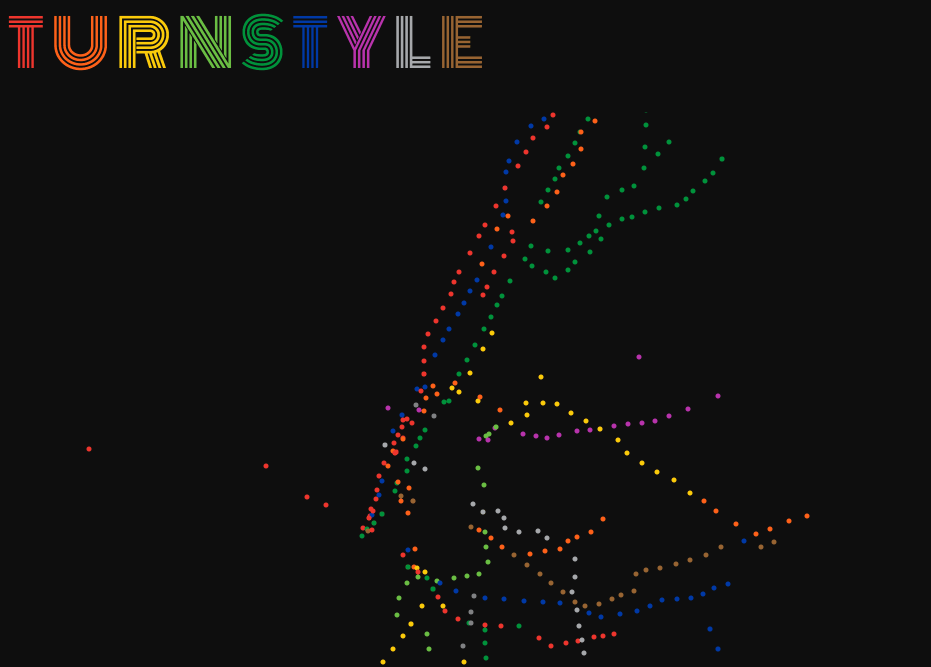

# This is 🌈🚃 TurnStyle 🚃🌈

I am an artistic visualization of turnstile data for the week of February 17

I was created with MapBox and MTA open data (found here: http://web.mta.info/developers/turnstile.html)

Each point on my map corresponds to an MTA station (and a few PATH stations). My color is decided by which line passes through the station (see here: http://web.mta.info/developers/resources/line_colors.htm). Starting at midnight on Saturday the 17th, I run through each data point for each available time. When a station has a record for that time, its geographical point grows in correspondence with the number of entries to that station. 

* Visit me at: https://turn-style.herokuapp.com

